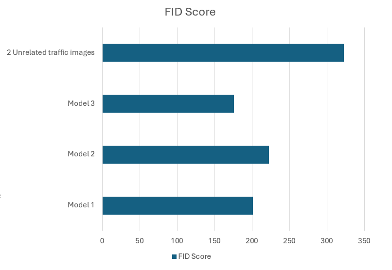

# lorem ipsum

## MIRPR Stable Diffusion Project

[Eduard-Mitrut Rosca](https://github.com/RoscaMitrut), [Albert Regus](https://github.com/RegusAl)

The system uses a model based on Stable Diffusion, like ControlNet, to create realistic synthetic images.

Our goal is to train a Stable Diffusion model that enhances text-to-image generation and can also create images based on simple shapes drawn by users.

The aim of this project is to train a model that can create traffic images based on the segmentation map and the depth map.

### Training

We used 3 different approaches:

    1. Training Using Segmentation Masks as Input
    2. Training Using Depth Masks as Input
    3. Training Using Both Segmentation Masks and Depth Masks

### Best results

The best model was trained using both the segmentation masks and the depth masks. This approach combined the spatial details with the depth information. This approach proved to be the most efficient, and the generated output was the closest to the target.

- segmentation mask combined with the depth mask

 
- the generated image  

- the target image

### Quality

To evaluate the training we used the FID (Frechet Inception Distance) metric that compares the statistical similarity between the generated and the real images.

Lower FID scores indicate that the generated images are closer in quality and diversity to real images, with a score of 0 representing perfect similarity.

Model 1 is the model that takes only the segmentation masks  
Model 2 is the model that takes only the depth masks  
Model 3 is the model that takes both the segmentation and the depth masks  
